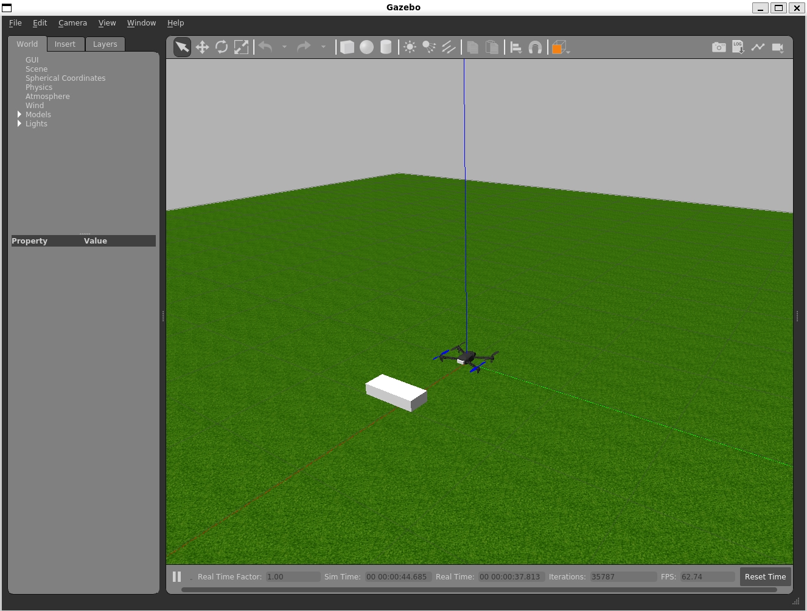
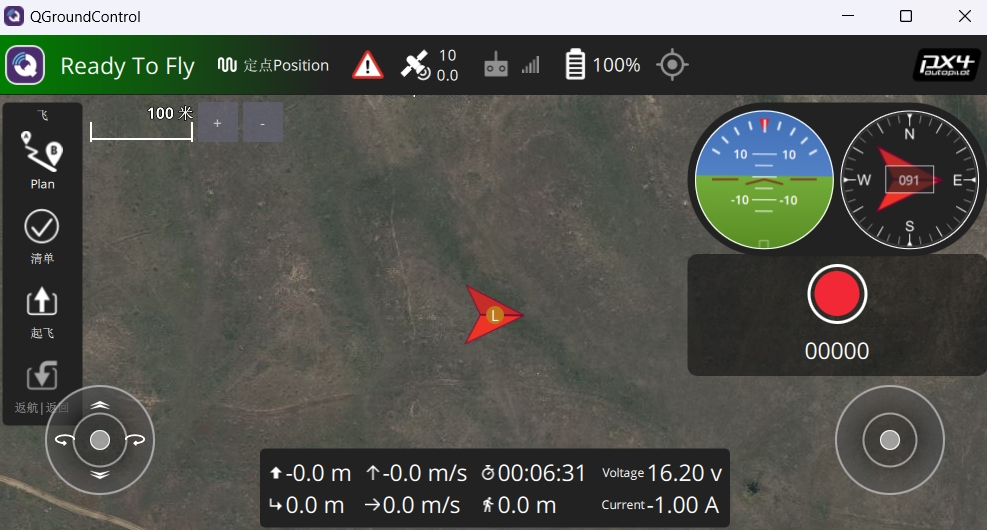
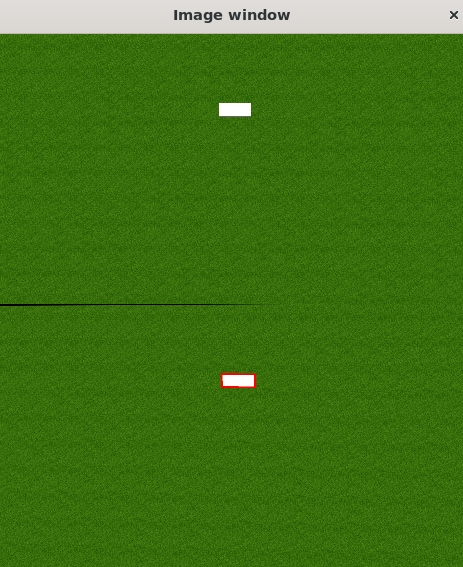

# 项目名称 / Project Name
# RME_IBVS

## 项目简介 / Project Introduction

本项目是一个基于PX4和ROS Noetic的无人机仿真项目，结合Gazebo仿真环境和视觉伺服控制技术，实现无人机的目标跟踪与控制。通过ROS节点实现图像处理、视觉伺服、观测器以及目标控制等功能。

This project is a UAV simulation project based on PX4 and ROS Noetic, combining the Gazebo simulation environment and visual servoing control technology to achieve target tracking and control of UAVs. ROS nodes are used to implement image processing, visual servoing, observer, and target control functions.

---

## 前置条件 / Prerequisites

在运行本项目之前，您需要安装以下软件和环境：

Before running this project, you need to install the following software and environments:

1. **PX4 Autopilot**: 无人机飞控软件。
   - 安装指南: [PX4官方安装文档](https://docs.px4.io/main/en/dev_setup/dev_env.html)
   - **PX4 Autopilot**: UAV flight control software.
     - Installation Guide: [PX4 Official Installation Documentation](https://docs.px4.io/main/en/dev_setup/dev_env.html)

2. **ROS Noetic**: 机器人操作系统。
   - 安装指南: [ROS Noetic安装文档](http://wiki.ros.org/noetic/Installation)
   - **ROS Noetic**: Robot Operating System.
     - Installation Guide: [ROS Noetic Installation Documentation](http://wiki.ros.org/noetic/Installation)

3. **Gazebo**: 仿真环境。
   - 通常与ROS Noetic一起安装。
   - **Gazebo**: Simulation environment.
     - Usually installed with ROS Noetic.
    
4. **QGroundControl (QGC)**: 地面站软件，用于控制无人机。
   - 下载地址: [QGroundControl官网](https://qgroundcontrol.com/)
   - **QGroundControl (QGC)**: Ground control software for UAV control.
     - Download: [QGroundControl Official Website](https://qgroundcontrol.com/)

---

## 准备工作 / Preparation

1. 将ROS启动文件 `my_UAV_sitl.launch` 复制到 `\PX4-Autopilot\launch` 目录中。
   - Copy the ROS launch file `my_UAV_sitl.launch` to the `\PX4-Autopilot\launch` directory.

2. 将世界文件 `my_sim_world.world` 复制到 `\PX4-Autopilot\Tools\simulation\gazebo-classic\sitl_gazebo-classic\worlds` 目录中。
   - Copy the world file `my_sim_world.world` to the `\PX4-Autopilot\Tools\simulation\gazebo-classic\sitl_gazebo-classic\worlds` directory.

3. 下载 `obvs_ws` 工作空间到本地，并使用 `catkin_make` 进行编译。
   - Download the `obvs_ws` workspace to your local machine and compile it using `catkin_make`.

   ```bash
   cd ~/obvs_ws
   catkin_make
   
4. 编译完成后，使用以下命令设置环境变量：
  - After compilation, set up the environment variables using the following command:
    
    ```bash
    source devel/setup.bash

---
## 运行项目 / Running the Project

1. 启动仿真环境：
   - Launch the simulation environment:

   ```bash
   roslaunch px4 my_UAV_sitl.launch



2. 打开QGroundControl (QGC) 地面站：
   - Open QGroundControl (QGC) ground station:
     - 启动QGC应用程序，并连接到仿真无人机。
     - Launch the QGC application and connect to the simulated UAV.

3. 控制无人机起飞至7米高度：
   - Control the UAV to take off to a height of 7 meters:
     - 在QGC界面中，选择“起飞”模式，并设置目标高度为7米。
     - In the QGC interface, select the "Takeoff" mode and set the target altitude to 7 meters.
     - 点击“起飞”按钮，无人机将自动起飞至指定高度。
     - Click the "Takeoff" button, and the UAV will automatically take off to the specified altitude.


4. 打开图像处理节点：
   - Start the image processing node:

   ```bash
   rosrun ibvs_proj image_processor_node
   
<center>
   
</center>

5. 打开视觉伺服节点：
   - Start the visual servoing node:

   ```bash
   rosrun ibvs_proj ibvs_node

6. 打开观测器节点：
   - Start the observer node:

   ```bash
   rosrun ibvs_proj observe_node

7. 运行目标控制节点：
   - Run the target control node:
   ```bash
   rosrun block_controller block_controller
---
## 结果展示 / Results
使用 rqt 查看运行结果。
Use rqt to view the running results.


